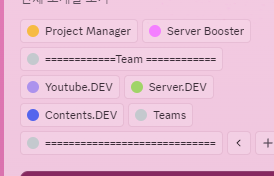

# [서린 스튜디오](https://discord.gg/eK794Myjs6) 통합 디스코드 봇

최대한 하드코딩 배제하였습니다~

### Bot Channel

\- Join Message!!!!!!!!!!!!!!!!!
> **환영해요!!!!!!!!!!**

 

\- Auto Role (With Contour)
> **자동 역할 부여를 넘어 역할을 예쁘게 꾸며준다.**
>
> 예시) 
> 

 

\- Work-Vocie-Chat For @Youtube/@Server/@Contents
> **해당 음성 채널에 들어가면,** 업무 기록 측정 시작한다.  
> \- 10분마다 유저 상태 측정을 하는데 오프라인이나 자리비움 상태가 시작되고 부터 30분 내에 다시 온라인이 되지 않는다면 해당 유저의 DM으로 `'자동 업무 기록 작성'`폼을 보낸다. 
> &nbsp;&nbsp;&nbsp;&nbsp;&nbsp;&nbsp;`자동 업무 기록 작성`: 자동 기록된 시간에 업무명과 소개, 추가로 사진을 올릴 수 있는 자동 작성 시스템

\- Work-Voice-Chat For ALL Teams
> 바로 위에 `"Work-Voice-Chat For @Youtube/@Server/@Contents"`와 동일 기능이다.
>
> **다만 역할이 여러개 (다중팀) 상태일 경우,** 하드코딩된 우선 순위를 따르게 된다. `@Youtube > @Server > @Contents`순서.

**비고: "`Work-Voice-Chat For @Role`과 `Work-Voice-Chat For ALL`은 통합되어 있다. (음성 채널 이동해도 임시데이터 병합됨)**

 

\- Log
> **로그는 두 종류로 나뉜다.**
> 1. `서버 로그`: 디스코드 봇 서버에서 작동하는 모든 것을 기록한다. (단, 이벤트가 무시된 경우 제외). 
     > &nbsp;&nbsp;&nbsp;&nbsp;&nbsp;&nbsp;\- `서버 로그`는 디스코드 봇이 구동되고 있는 로컬에 저장된다. `'./logs/~~'`
> 2. `디스코드 로그`: 유저의 입장, 차단, 퇴장, 역할 부여, 제거, 메시지 삭제 등을 기록한다. 